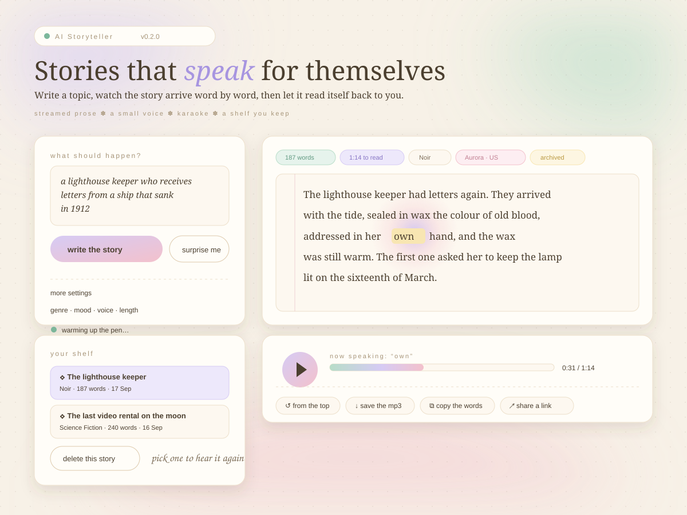

<div align="center">

# KOTORI

**A pastel paper studio that writes you a story and reads it aloud.**

One line in. A four-hundred-word story out, typed onto the page word by word, then
spoken back while every word warms up in time with the voice.

[](https://github.com/colombefioren/kotori/actions/workflows/ci.yml)


<a href="docs/preview.svg"></a>

<sub>↑ drawn from the real markup and palette — in the app the prose streams in word by word, then reads itself back.</sub>

</div>

---

## contents

- [the thirty-second version](#the-thirty-second-version)
- [the three tabs](#the-three-tabs)
- [what is actually in here](#what-is-actually-in-here)
- [how the karaoke works](#how-the-karaoke-works)
- [run it locally](#run-it-locally)
- [the design system](#the-design-system)
- [architecture](#architecture)
- [keyboard](#keyboard)
- [deploy it](#deploy-it)
- [tests, lint and ci](#tests-lint-and-ci)
- [notes on taste](#notes-on-taste)
- [roadmap](#roadmap)
- [credits](#credits)

---

## the thirty-second version

```bash
git clone https://github.com/colombefioren/kotori && cd kotori
uv sync            # installs the studio and its dev tools
uv run kotori      # → http://127.0.0.1:7860
```

**No key? Just press _write the story_.** The studio ships three original demo reels, so
the whole experience — the waiting page, the streaming prose, the synthesised voice, the
karaoke, the archive, the exports — works before you have ever opened `.env`. Add
credentials whenever you like and the same button writes something nobody has read before.

```ini
# .env — any OpenAI-compatible endpoint
MODEL_NAME=your-model                      # whatever your provider serves
API_KEY=sk-…                               # without one, the studio stays on its demo reels
BASE_URL=https://api.your-endpoint.com/v1  # leave empty for OpenAI, or point at a gateway
```

---

## the three tabs

Three paper tabs across the top, drawn as real paper rather than as a framework widget.
They flip instantly in the browser — all three rooms stay in the DOM, so switching never
re-mounts a player and never loses a recording.

| # | tab | what lives there |
|:--|:--|:--|
| 01 | **home** | what KOTORI is, a little tutorial in three taped steps, the small print, and two ways in: *start writing* or *hear a demo reel* |
| 02 | **playground** | the brief on the left (topic, genre, mood, voice) with the reader beside it — play button, seek rule, exports — and the story itself written full width underneath, on torn ruled paper |
| 03 | **history** | every story ever kept, as index cards in the ledger, each one with its own player, its own recording and its own exports |

The genre field accepts anything: pick one of the ten built in, or paste a register of your
own. **The length is not a setting.** Every story is four hundred words — long enough to
have weather, short enough for a coffee.

<details>
<summary><b>why the tabs are not a framework component</b></summary>

Gradio's tab widgets render with their own internal markup, which made a paper look
impossible to reach and left keyboard shortcuts pointing at nothing. KOTORI draws its own
`role="tablist"`, keeps the rooms mounted, and flips a `data-room` attribute on `<html>`.

Two consequences worth knowing:

- switching tabs is a class change, not a server round-trip — the app feels like a page;
- when the *server* needs to move you (a demo reel, or opening an old story), it renders a
  hidden room signal which the client watches with a `MutationObserver`. No polling, no
  duplicated state, and one obvious place where "which room am I in" lives.

</details>

---

## what is actually in here

| | |
|:---|:---|
| **A loading state, always** | The button answers the instant it is pressed: a ruled page, a waiting cursor and a hopping status line appear before the model's first token, and the button locks itself while the writer works. |
| **Live teleprompter** | Tokens land one at a time on ruled paper; a rose caret marks where the writer is and the page scrolls itself. |
| **Karaoke playback** | The mp3 drives the page: spoken words stay ink, the word being read sits on a pastel highlighter mark, the ones ahead wait, faint. |
| **Trailing halo** | A soft pink-and-blue light follows the spoken word down the page, on `requestAnimationFrame` — the actual reading position, not decoration. |
| **One player per story** | Every reader carries its own `<audio>` and points at its own page (`data-paper`), so a shelf full of stories can never play the wrong voice. |
| **A shelf you can listen to** | Every card in the history plays its own recording; a voice is only synthesised when the file is genuinely missing. |
| **Cursor trail** | A canvas ribbon of pastel ink follows the pointer — toggled with `T`, remembered in `localStorage`, and off by default under reduced motion. |
| **Pink and blue pastels** | Two desks: the day desk (light paper) and the night desk (dark). Both are cut from the same two pastel families, so tape, highlighter and stamps agree in each. |
| **Twelve voices** | Presets across eight languages and accents, from `Aurora (US)` to `Nori (JP)`. |
| **Ten genres × eight moods** | Every register carries a note that steers the brief — "neon rain, rented bodies, debt". |
| **Client-side exports** | Markdown, mp3 and share links are assembled in the browser; nothing extra is uploaded. |
| **A real archive** | Drafts land in an append-only JSONL shelf you can read, re-record, delete or clear. |
| **A command palette** | `⌘/Ctrl + K`, `/` to jump to the brief, `space` to play, `?` for the whole shortcut sheet. |
| **Deployable as-is** | Dockerfile, compose file, Render blueprint, Spaces front matter, CI with a coverage floor, CD that publishes multi-arch images. |
| **Template-safe** | Every user- and model-authored string goes through `html.escape`; prose cannot inject markup into the page. |

<details>
<summary><b>the details that make it feel handmade</b></summary>

- **Torn paper edges.** The story sheet is clipped with a hand-written 36-point polygon, so
  its silhouette is ragged where a page was torn out of a notebook — and the drop shadow
  follows that silhouette instead of a rectangle.
- **Washi tape.** Strips have a printed sheen, an irregular cut, a real rotation, and they
  give a little when you hover the card they are stuck to.
- **Index cards, not cards.** Every story in the history is cream stock with a rose header
  rule, a punched index number, a rubber-stamped date and its own little player.
- **A polaroid.** The home page has a flat riso-printed print of the bird the studio is
  named after, taped into a white frame with a handwritten caption. It sways when hovered.
- **Handwriting in the margins.** *Kalam* carries the asides ("stuck? press surprise me"),
  the status line and the empty states — the voice of someone leaning over your shoulder.
- **Typewriter labels.** *Special Elite* stamps every label, chip and footer line, the way a
  scrapbook keeper would.

</details>

---

## how the karaoke works

No forced-alignment model, no second API call, no paid timing service — the engine is about
sixty lines and fully unit-tested.

```text
prose ──▶ word weights ──▶ data-w on every <span> ──▶ cumulative fractions
  timing.py                    markup.py                 teleprompter.js
                                                                │
  mp3 duration ─────────────────────────────────────────────────┤
                                                                ▼
                             currentTime ÷ duration ──▶ word index
                                                                │
                          ┌─────────────────────────────────────┼─────────────────────┐
                          ▼                                     ▼                      ▼
                    words behind                          current word            words ahead
                    stay ink                    highlighter mark + halo          wait, faint
```

A word's weight is a base plus its length plus a pause for its trailing punctuation, so
`debt.` really does take longer than `as`. Because the browser divides by the audio's true
`duration`, a different accent, a slower voice or a re-recording all stay in sync with no
server round-trip once the audio exists.

<details>
<summary><b>the client contract</b> (four scripts, no build step)</summary>

| script | owns |
|:--|:--|
| `trail.js` | the shared `ASTBus` DOM bus, the paper / night-desk switch, the cursor canvas |
| `teleprompter.js` | one player per deck: word timing, the halo, play/pause, the seek rail, auto-scroll |
| `deck.js` | copy, `.md`/`.mp3` saves and share links, scoped to the deck the button lives in |
| `shell.js` | the index tabs, toasts, command palette, shortcuts sheet, `#s=` link restore |

`ASTBus` is a `MutationObserver` plus one `requestAnimationFrame` flush, so each script
re-binds its own nodes whenever Gradio swaps component HTML — no polling, no double
binding. Every player is dropped the moment its deck leaves the DOM, which is what makes
"the audio is for the previous story" impossible.

</details>

---

## run it locally

```bash
uv sync                 # uv installs the project (and dev tools) into .venv
cp .env.example .env    # then edit MODEL_NAME / API_KEY / BASE_URL
uv run kotori           # same as: uv run python app.py  ·  uv run python -m kotori
```

### configuration

| variable | default | purpose |
|:--|:--|:--|
| `MODEL_NAME` | `gpt-4o-mini` | any chat model your endpoint serves |
| `API_KEY` | — | needed for a real writer (`OPENAI_API_KEY` is read too); without one the studio uses its demo reels |
| `BASE_URL` | OpenAI | point at whatever gateway you use |
| `TEMPERATURE` | `0.9` | the writer's temperature |
| `MAX_TOKENS` | `900` | a hard ceiling per story |
| `REQUEST_TIMEOUT` | `60` | seconds before a write is abandoned |
| `KOTORI_DATA_DIR` | `./data` | archive + rendered mp3s (`AI_STORYTELLER_DATA_DIR` still works, so old volumes keep opening) |
| `KOTORI_THEME` | `light` | which desk to open on — `light` or `dark`. Visitors can switch it themselves |
| `PORT` / `GRADIO_SERVER_PORT` | `7860` | the server port (`PORT` wins; that is what hosts inject) |
| `GRADIO_SERVER_NAME` | `0.0.0.0` | bind address |

---

## the design system

<div align="center">


&nbsp;


&nbsp;


</div>

| token | light | dark | used for |
|:--|:--|:--|:--|
| `--desk` | `#f2e8ee` | `#191725` | the surface everything is pinned to, with two pastel washes dried into it |
| `--paper` / `--paper-2` | `#fffdfa` / `#fdf7f8` | `#262233` / `#221f2e` | cards and the story sheet · inputs |
| `--cream` | `#fdf9f0` | `#2a2636` | the index cards in the history |
| `--ink` / `--ink-2` / `--ink-3` | `#443b48` / `#6f6573` / `#9d94a2` | `#f4eff8` / `#c6bdd2` / `#8f87a3` | prose · labels · words not yet spoken |
| `--pink-300/400/500` | `#f2b3cd` / `#e288ae` / `#bd5f8b` | `#8d5c74` / `#e79cbe` / `#f4b6d2` | the margin rule, stamps, the primary action, errors |
| `--blue-200/300/400` | `#d8e7fa` / `#b3d0f2` / `#82aae0` | `#2a3550` / `#5d7dae` / `#9dc0ee` | washi tape, the spoken word, focus, the play button |
| type | Fraunces · EB Garamond · Karla · Kalam · Special Elite | — | headlines · prose · interface · margins · labels |
| geometry | 4–12px paper corners · a 36-point torn edge · 2px hard sticker shadows | — | the scrapbook |

Everything lives in `assets/styles/tokens.css`, and `theme.py` mirrors the same palette
into Gradio's own theme so components that ship their own CSS still match. The stylesheets
are split **tokens → layout → components → animations**, so a change of mood means editing
one file rather than hunting through a thousand lines. The five typefaces are requested
once, in the document head, from Google Fonts.

---

## architecture

```text
src/kotori/
├── config.py       env → Settings (aliases, coercion, writable-dir fallback)
├── llm.py          the chat-model factory, for any OpenAI-compatible endpoint
├── prompts.py      genres, moods, the brief, prose cleanup
├── story.py        the streaming writer (frames are paced, not dumped)
├── demo.py         three original reels, so the studio opens without a key
├── speech.py       voice presets, gTTS synthesis, mp3 delivery
├── timing.py       word weights → the karaoke timeline
├── library.py      append-only JSONL archive + stats
├── models.py       StoryRequest / StoryDraft + reading-time maths
├── markup.py       the index tabs, the polaroid, the page, the readers, the ledger
├── studio.py       controller: write → voice → file away (cached recordings)
├── callbacks.py    every button's handler, Gradio-free enough to unit-test
├── theme.py        the Gradio theme, mirroring the CSS tokens
├── frontend.py     css / js / head bundle loader
├── ui.py           the three rooms and the event wiring
├── app.py          launch(): theme, css, js, favicon, port
└── assets/
    ├── styles/     tokens · layout · components · animations
    ├── scripts/    trail · teleprompter · deck · shell
    └── favicon.svg the little bird
```

**Why the split?** `studio.py` returns plain HTML strings and dataclasses, and
`callbacks.py` holds every button's handler, so the whole product can be driven from tests,
a notebook or a CLI **with Gradio nowhere near the logic**. `ui.py` stays a thin skin of
components and events over that controller — which is why 176 tests run offline in about
nine seconds at 95% coverage.

```
script ─▶ callbacks.py ─▶ studio.py ─▶ story.py ─▶ llm.py
                             │            └──▶ demo.py  (no credentials)
                             ├──▶ speech.py ─▶ gTTS ─▶ data/audio/*.mp3
                             ├──▶ library.py ─▶ data/library.jsonl
                             └──▶ markup.py ─▶ HTML ─▶ Gradio ─▶ the browser
                                                    │
                                          teleprompter.js drives the karaoke
```

---

## keyboard

| key | action | | key | action |
|:--|:--|:--|:--|:--|
| `⌘/Ctrl + K` | command palette | | `1` `2` `3` | home · playground · history |
| `/` | jump to the brief | | `←` `→` on a tab | walk the index tabs |
| `⌘/Ctrl + Enter` | write the story | | `P` | open a shared story |
| `space` | play / pause the voice | | `T` | toggle the cursor trail |
| `←` `→` | skip five seconds | | `D` | switch the paper |
| `?` | the shortcut sheet | | `Esc` | close overlays |

---

## deploy it

Anything that runs a container and gives you a public port will host this untouched. The
image is a single Python 3.12 stage, runs as an unprivileged user, declares a
`HEALTHCHECK`, and writes its archive to `KOTORI_DATA_DIR` (default `/data`).

| path | best for | how |
|:--|:--|:--|
| **Hugging Face Spaces** | a free public demo | the front matter at the top of this file already says `sdk: docker` + `app_port: 7860` — push the repo, then add secrets and attach storage for `/data` |
| **Render** | blueprint + disk | `render.yaml` describes a Docker service with a 1 GB disk at `/var/data` → *New → Blueprint* |
| **Docker anywhere** | VPS, homelab, CI | `docker build -t kotori .` then run it with `-v kotori-data:/data` |
| **Fly.io / Cloud Run / Koyeb** | managed containers | point them at the Dockerfile and give it a volume for `/data` |

```bash
# the whole thing, locally, in a container
docker compose up --build        # reads .env, mounts ./data
```

<details>
<summary><b>Space secrets</b></summary>

| secret | example |
|:--|:--|
| `MODEL_NAME` | `gpt-4o-mini` |
| `API_KEY` | `sk-…` |
| `BASE_URL` | `https://api.openai.com/v1` |

> Serverless and edge platforms are a poor fit: this is a long-running server with
> WebSocket streaming and a writable disk, not a request/response function.
</details>

---

## tests, lint and ci

```bash
uv run pytest                       # 176 tests, fully offline, ~9 s
uv run ruff check src tests         # E F I UP B SIM C4 RUF
uv run ruff format --check src tests

# what CI runs on top of that
uv run pytest -q --cov=kotori \
  --cov-report=term-missing:skip-covered --cov-fail-under=90
```

The network is never touched: the writer is faked, speech synthesis is monkeypatched, and
the app is assembled without ever being launched. The suite covers env parsing, the chat
factory, prose cleanup, word timing, the archive, the HTML renderers, the domain model, the
studio pipeline, every interface callback, the demo reels, the accessibility landmarks, the
index tabs and rooms, and the assembled app.

### continuous integration and delivery

| workflow | trigger | what it does |
|:--|:--|:--|
| [`ci.yml`](.github/workflows/ci.yml) | every push and PR | lint → format check → tests with a **90% coverage floor** → docker build |
| [`deploy.yml`](.github/workflows/deploy.yml) | `v*` tags or manual | publishes a **multi-arch image to GHCR** (`linux/amd64`, `linux/arm64`) and, when the `HF_SPACE` repository variable is set, mirrors the commit to a Space |

```bash
# a released image, ready to run
docker run -p 7860:7860 -v kotori-data:/data \
  -e MODEL_NAME=gpt-4o-mini -e API_KEY=sk-… \
  ghcr.io/colombefioren/kotori:latest
```

To enable the Space mirror: add a repository **variable** `HF_SPACE` (`user/space-name`)
and a secret `HF_TOKEN` with write access. Skip both and the job simply does not run.

There is also a developer helper that drives the live API the way the browser does:

```bash
uv run python scripts/smoke.py      # demo mode on a spare port, then prints a report
```

---

## notes on taste

- **Paper, not a dashboard.** The interface is a page you write on: one column of reading,
  ruled lines, a rose margin, tape holding the corners down. Pastels do the pointing, so
  nothing has to shout — no neon, no glow, no gradient chrome.
- **Two pastels, used honestly.** Pink means *here* (the margin, the current action, the
  play button's accent), blue means *said* (tape, the highlighter, focus). Everything else
  is ink and paper.
- **Scrapbook, not skeuomorphism.** No fake leather, no drop-cap drop shadows, no
  brushed-metal anything. Torn edges, tape and handwriting, held together by real
  typography.
- **A loading state is part of the design.** Pressing the button paints a ruled page and a
  waiting cursor immediately — the writer is never a silent freeze — and the button is
  handed back by the last frame, or by *stop*.
- **One player per story.** Each reader owns its audio, its page and its exports; the
  recording on disk is reused, so "let me hear that one again" is instant and correct.
- **Motion earns its place.** The halo tracks the spoken word because it *is* the reading
  position; the cursor trail is the only purely ambient effect, and it has an off switch
  (`T`), a preference in `localStorage`, and respect for reduced motion.
- **Nothing is hidden from the keyboard.** A skip link, landmarks, a real `tablist`,
  labelled player controls, `aria-live` only on the live page and the waiting page, and a
  `display:block` fallback for every room when scripting is off.

---

## roadmap

- Real forced alignment (Whisper timestamps) for per-word accuracy.
- A "keep going" loop that extends a draft without losing the thread.
- Optional SQLite or Redis store, so several replicas can share one shelf.
- Export a bundle (text + audio) or a printable broadsheet PDF.

---

## credits

Written by **[colombefioren](https://github.com/colombefioren)**. Voices come from Google
Translate's speech service via [gTTS](https://github.com/pndurette/gTTS); the interface is
[Gradio 6](https://www.gradio.app) wearing a hand-cut stylesheet; the prose is whatever
your model dreams up at `temperature=0.9`.

**MIT** — see [LICENSE](LICENSE). Take it, restyle it, ship it.

<div align="center"><sub>🐦 drafts are yours · keys are yours · nothing is tracked</sub></div>
